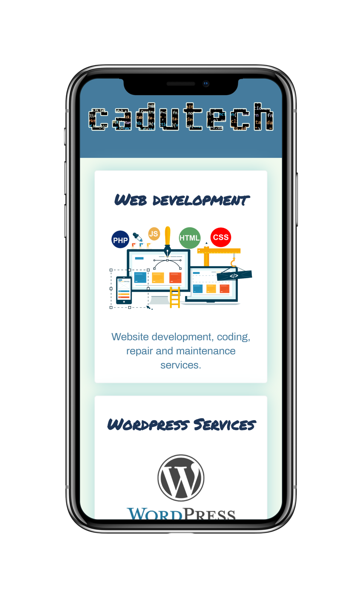

# CaduTech-landing
 
<h1 align="center" style="font-weight: bold">Cadutech Webpage</h1>

Landing Page of my personal and service website by: 

<h1 align="center">
    
</h1>

 &nbsp;&nbsp;&nbsp;&nbsp;

  

  <a href="#used-technologies">Used Technologies</a>&nbsp;&nbsp;&nbsp;|&nbsp;&nbsp;&nbsp;
  <a href="#the-project">The Project</a>&nbsp;&nbsp;&nbsp;|&nbsp;&nbsp;&nbsp;
  <a href="#the-layout">The Layout</a>&nbsp;&nbsp;&nbsp;|&nbsp;&nbsp;&nbsp;
  <a href="#license">License</a>

## Used Technologies

This project was developed using the technologies below:

- [HTML5](https://developer.mozilla.org/en-US/docs/Web/Guide/HTML/HTML5)
- [CSS](https://developer.mozilla.org/en-US/docs/Web/CSS)

## The Project

Landing Page of my personal and service website fully developed using mobile first concepts.

## The Layout

### Mobile Version

   

   

### Web Version

 

## License

This project is under the MIT license. See the file [LICENSE](LICENSE.md) for additional details.

---
